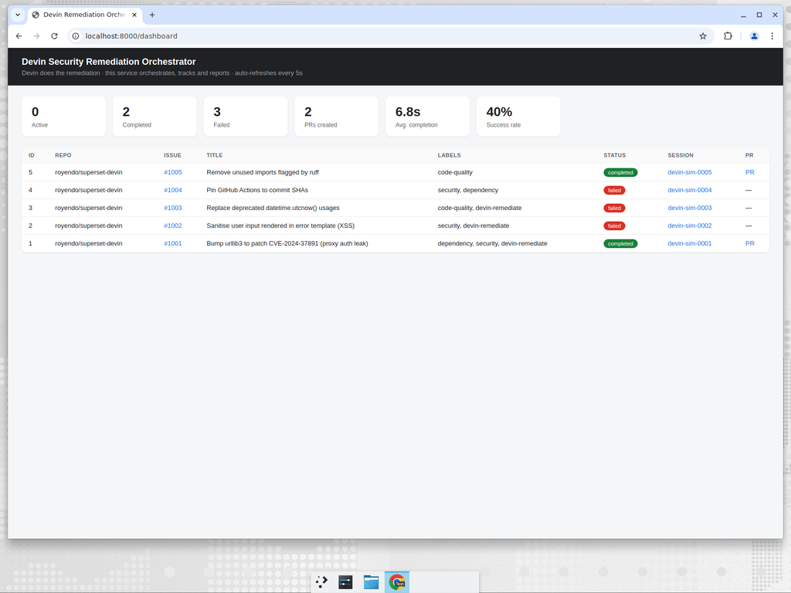

<!--
Licensed to the Apache Software Foundation (ASF) under one
or more contributor license agreements.  See the NOTICE file
distributed with this work for additional information
regarding copyright ownership.  The ASF licenses this file
to you under the Apache License, Version 2.0 (the
"License"); you may not use this file except in compliance
with the License.  You may obtain a copy of the License at

  http://www.apache.org/licenses/LICENSE-2.0

Unless required by applicable law or agreed to in writing,
software distributed under the License is distributed on an
"AS IS" BASIS, WITHOUT WARRANTIES OR CONDITIONS OF ANY
KIND, either express or implied.  See the License for the
specific language governing permissions and limitations
under the License.
-->

# Devin Security Remediation Orchestrator

An event-driven automation that turns labeled GitHub issues into Devin
remediation sessions, tracks their progress, and reports observable outcomes.

> **Devin does the remediation. This service only orchestrates, tracks and
> reports.** It never edits code itself — it classifies eligible issues, starts
> Devin sessions through the Devin API, polls their status, and surfaces metrics
> and a dashboard.

## How it works

This is a **self-standing monitor**: it polls the GitHub API for the target
repository on a fixed interval, finds open issues carrying a trigger label, and
starts a Devin session for each new one. No public URL or webhook configuration
is required — just run the server.

```
                 ┌──────── every ISSUE_POLL_INTERVAL_SECONDS ────────┐
                 │            (or POST /poll/run, or press 's')        │
                 ▼                                                     │
   GET /repos/{repo}/issues?state=open ──►  open issues               │
        │                                                             │
        ▼                                                             │
┌─────────────────────────────┐                                      │
│  FastAPI orchestrator        │                                      │
│  1. filter by trigger label  │                                      │
│  2. dedupe by repo+issue     │                                      │
│  3. create Devin session ────┼──►  POST /v3/organizations/{org}/sessions
│  4. persist task (SQLite)    │                                      │
└─────────────────────────────┘                                      │
        ▲                                                             │
        │  session-reconciliation worker ─────────────────────────────┘
        │  GET /v3/organizations/{org}/sessions/{id}
        ▼
   status + PR URL  ──►  /dashboard (HTML)  +  /metrics (JSON)
```

A task is started for any **open** issue carrying one of the trigger labels
(default `devin-remediate`, `security`, `dependency`, `code-quality`). Issues are
deduped by `repo + issue number`, so repeated scans never start a second session
for the same issue.

### Triggering a scan manually

Besides the interval, you can force an immediate scan two ways:

- **HTTP:** `curl -X POST http://localhost:8000/poll/run` — returns a JSON
  summary (`scanned`, `eligible`, `triggered`, `duplicate`, `ignored`, `errors`).
- **Keyboard:** when the server runs attached to a terminal, press **`s`** to
  scan now (Ctrl-C to quit). Disabled automatically when stdin is not a TTY.

## Companion repository

This orchestrator was built to drive remediations on a fork of Apache Superset:
[`royendo/superset-devin`](https://github.com/royendo/superset-devin). That repo
contains the selected issues and their remediation PRs, plus a serverless
GitHub Actions trigger (`@Devin` comment / `devin-remediate` label) that starts a
Devin session directly from GitHub — the lightweight Phase 1 counterpart to this
service.

## Endpoints

| Method | Path                | Description                                       |
| ------ | ------------------- | ------------------------------------------------- |
| POST   | `/poll/run`           | Manually trigger an immediate repository scan      |
| POST   | `/simulate/issue`     | Inject a synthetic issue (simulation mode only)   |
| GET    | `/metrics`            | JSON metrics (task state, outcomes, throughput, scan funnel) |
| GET    | `/dashboard`          | HTML dashboard (auto-refreshing)                  |
| GET    | `/health`             | Liveness + mode + monitored repo                  |

## Task state (SQLite)

Each task row stores: issue URL, issue number, repo, Devin session ID, Devin
session URL, status (`pending`/`running`/`completed`/`failed`), `created_at`,
`updated_at`, `completed_at`, PR URL (when available), and an error message on
failure.

## Observability — "how would I know this is working?"

Three layers answer that question without any external tooling:

1. **HTML dashboard** (`/dashboard`, auto-refresh): a liveness strip (mode,
   scans run, last/next scan, uptime), headline cards (detected, triggered,
   active, completed, failed, PRs, success rate, throughput/hr, avg & median
   time-to-PR), a **scan funnel** (detected → eligible → triggered → ignored →
   deduped), a **failure-reasons** panel, and the per-task table with status
   badges and session/PR links.
2. **JSON metrics** — `/metrics` exposes all of the above for scripting or
   piping into any monitoring tool.
3. **Structured logs** — every scan emits one greppable line:
   `scan complete scanned=… eligible=… triggered=… duplicate=… ignored=… errors=…`,
   plus per-session start/reconcile lines, for log-based monitoring.

What each signal tells a leader:

| Question                              | Signal                                              |
| ------------------------------------- | --------------------------------------------------- |
| Is the monitor alive and polling?     | `last_scan_at`, `next_scan_in_seconds`, `scans_completed`, `uptime_seconds` |
| Is it acting on the right issues?     | scan funnel: `issues_detected_total` → `triggered_total` / `ignored_total` / `duplicate_total` |
| Are remediations succeeding?          | `success_rate`, `completed_sessions` vs `failed_sessions` |
| When they fail, why?                  | `failure_reasons` (grouped error messages)          |
| How fast / how much work flows?       | `throughput_per_hour`, `average_/median_completion_seconds` |

> Task metrics (completed/failed/PRs) are persisted in SQLite and survive
> restarts; the scan-funnel/liveness counters are in-memory and reset on
> restart.



## Environment variables

| Variable                       | Default                          | Notes                                            |
| ------------------------------ | -------------------------------- | ------------------------------------------------ |
| `SIMULATION_MODE`              | `false`                          | Use the built-in fake Devin client               |
| `DEVIN_API_KEY`                | —                                | Service-user key (`cog_...`); required for LIVE   |
| `DEVIN_ORG_ID`                 | —                                | Organization ID; required for LIVE               |
| `DEVIN_API_BASE`               | `https://api.devin.ai/v3`        | Devin API base URL                               |
| `GITHUB_REPO`                  | `royendo/superset-devin`         | Repository the monitor polls for issues          |
| `GITHUB_TOKEN`                 | —                                | PAT to read issues (Issues: Read-only); optional for public repos |
| `GITHUB_API_BASE`              | `https://api.github.com`         | GitHub REST API base URL                         |
| `DATABASE_PATH`                | `data/orchestrator.db`           | SQLite file path                                 |
| `POLL_INTERVAL_SECONDS`        | `15`                             | Session reconciliation interval                  |
| `ISSUE_POLLING_ENABLED`        | `true`                           | Set `false` to scan only on manual triggers      |
| `ISSUE_POLL_INTERVAL_SECONDS`  | `30`                             | How often the monitor scans the repo for issues  |
| `TRIGGER_LABELS`               | `devin-remediate,security,dependency,code-quality` | Comma-separated      |
| `SIM_SESSION_DURATION_SECONDS` | `20`                             | Simulated session runtime                        |
| `SIM_FAILURE_RATE`             | `0.2`                            | Fraction of simulated sessions that fail         |
| `HOST` / `PORT`                | `0.0.0.0` / `8000`               | Bind address                                     |

If `DEVIN_API_KEY`/`DEVIN_ORG_ID` are missing, the service automatically falls
back to simulation mode.

## Quick start (Docker, simulation)

```bash
docker compose up --build
```

This boots in simulation mode (no credentials needed). The monitor immediately
"discovers" a built-in set of synthetic issues and starts simulated sessions for
them, so the dashboard fills up on its own. You can also drive it explicitly from
another shell:

```bash
# force an immediate scan
curl -X POST http://localhost:8000/poll/run
# or run the demo driver, which injects issues and waits for them to settle
docker compose exec orchestrator python scripts/demo.py
python scripts/demo.py --base-url http://localhost:8000   # from the host
```

Open the dashboard at <http://localhost:8000/dashboard> and metrics at
<http://localhost:8000/metrics>.

## Quick start (local Python)

```bash
make install          # creates .venv and installs deps + pytest
make run-sim          # starts uvicorn in simulation mode on :8000
# in another terminal:
make demo             # drives the end-to-end simulation
make test             # runs the test suite
```

## Local simulation explained

Simulation mode swaps the real Devin HTTP client for `SimulatedDevinClient` and
the real GitHub issue source for `SimulatedIssueSource`. The simulated client
reports each session as `running` for `SIM_SESSION_DURATION_SECONDS` and then
deterministically transitions to `finished` (with a fake PR URL) or `error`
based on a hash of the session id; the simulated source returns a fixed set of
eligible issues for the monitor to find. Together they exercise the **entire**
pipeline — issue polling, label filtering, dedupe, persistence, the
reconciliation worker, the dashboard and metrics — without any GitHub or Devin
credentials.

`POST /simulate/issue` generates a realistic eligible issue and routes it through
the same trigger path the monitor uses.

## Going LIVE

1. Create a Devin service user and key; note your org ID
   (Settings → Service Users). See the
   [Devin API docs](https://docs.devin.ai/api-reference/common-flows).
2. Copy `.env.example` to `.env` and set `SIMULATION_MODE=false`,
   `DEVIN_API_KEY`, `DEVIN_ORG_ID`, `GITHUB_REPO`, and (recommended)
   `GITHUB_TOKEN` — a fine-grained PAT scoped to the repo with
   **Issues: Read-only** (optional for a public repo, but avoids the 60 req/hr
   unauthenticated rate limit).
3. Run the server. As a polling monitor it needs no inbound network access, so
   it can run anywhere with outbound HTTPS to GitHub and the Devin API.

```bash
docker compose up --build   # reads .env; LIVE when SIMULATION_MODE=false
# or, locally:
make install && make run     # press 's' in the terminal to scan now
```

`docker-compose.yml` reads every setting from `.env` (with simulation-friendly
defaults), so going LIVE needs no edits to the compose file. The `s` keyboard
shortcut needs an attached terminal, so use `make run` (or `POST /poll/run`)
rather than `docker compose up` if you want the key.

> Devin opens the actual pull requests through your Devin ↔ GitHub integration;
> `GITHUB_TOKEN` is only used by this service to *read* issues.

## Project layout

```
app/
  config.py        # env-driven settings
  models.py        # pydantic models + status constants
  db.py            # SQLite task store
  devin_client.py  # real + simulated Devin clients
  issues.py        # real + simulated GitHub issue sources (polling)
  github.py        # label-based eligibility + Devin prompt build
  orchestrator.py  # core: scan/classify -> start session -> reconcile -> metrics
  poller.py        # IssuePoller (monitor) + PollingWorker (session reconcile)
  keyboard.py      # 's' keyboard shortcut to trigger a scan
  dashboard.py     # HTML rendering
  simulation.py    # synthetic issue generation for demos
  main.py          # FastAPI wiring
scripts/demo.py    # end-to-end demo driver
tests/             # unit + integration tests
```

## Tests

```bash
make test    # or: .venv/bin/python -m pytest tests/ -q
```
